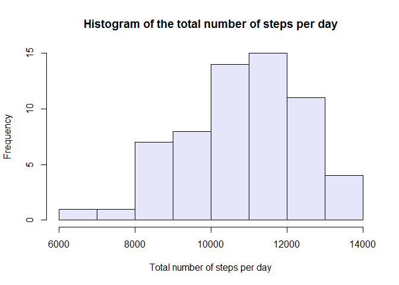

# Reproducible Research: Peer Assessment 1

## Loading and preprocessing the data
  
First, the code checks if the "activity.csv" file exists. If not, it extracts it from the zip file (assuming the zip file is already in the directory). After the file is ready it is read to the activityData data frame.


```r
if (!file.exists("activity.csv")) {unzip(activity.zip)}
activityData<-read.csv("activity.csv")
```

Set the computer language to english


```r
Sys.setlocale("LC_TIME", "English") 
```

```
## [1] "English_United States.1252"
```

## What is mean total number of steps taken per day?

The total number of steps taken per day is calculated by splitting the data by dates, summing the number of steps for each day. 


```r
activityByDate<-split(activityData$steps,levels(activityData$date))
numOfSteps<-sapply(activityByDate,function(x) sum(x,na.rm = TRUE))
```

The results are used to draw a histogram of the total number of steps per day over the entire period.


```r
h1_xlabel<-"Total number of steps per day"
h1_title<-"Histogram of the total number of steps per day"
hist(numOfSteps, col = "lavender", main = h1_title, xlab = h1_xlabel)
```

 

Next, the mean and median of the total number of steps taken per day are calculated.  


```r
meanNumOfSteps<-mean(numOfSteps)
medianNumOfSteps<-median(numOfSteps)
```

The mean total number of steps is 9354.2295082.  
The median total number of steps is 9408.

## What is the average daily activity pattern?


```r
activityByInterval<-split(activityData$steps,activityData$interval)
intervalVector<-levels(factor(activityData$interval))
meanIntervalSteps<-sapply(activityByInterval,function(x) mean(x,na.rm = TRUE))
p1_xlabel<-"Interval"
p1_ylabel<-"Mean number of steps"
plot(intervalVector, meanIntervalSteps, type = "l", xlab = p1_xlabel, ylab = p1_ylabel, xaxp = c(0, 2400, 24))
```

 

Calculate the interval with the maximum mean number of steps.


```r
maxInterval<-intervalVector[which.max(meanIntervalSteps)]
```

The interval with the highest mean number of steps is 835.

## Imputing missing values

Calculate the number of NAs in the data.  


```r
numberOfNAs<-sum(is.na(activityData$steps))
```

There are 2304 missing values in the dataset.  
We will copy the data to a new data frame and replace the missing values with the mean number of steps for each day.


```r
filledActivityByDate<-activityByDate
meanOfStepsPerDay<-sapply(activityByDate,function(x) mean(x,na.rm = TRUE))
for (i in 1:length(meanOfStepsPerDay)) {
  filledActivityByDate[[i]][is.na(activityByDate[[i]])]<-meanOfStepsPerDay[i]  
}
```

Draw a new histogram of the total number of steps taken each day.  


```r
filledNumOfSteps<-sapply(filledActivityByDate,function(x) sum(x,na.rm = TRUE))
hist(filledNumOfSteps, col = "lavender", main = h1_title, xlab = h1_xlabel)
```

 

Calculate the new mean and median of the total number of steps per day


```r
filledMeanNumOfSteps<-mean(filledNumOfSteps)
filledMedianNumOfSteps<-median(filledNumOfSteps)
```

The mean was 9354.2295082 and now is 1.0768212\times 10^{4}  
The median was 9408 and now is 1.0794837\times 10^{4}  
Replacing the NA values increased the mean and median total number of steps. This is reasonable since we replaced cells without data with non-zero number of steps and therefor increased the total number of steps.

## Are there differences in activity patterns between weekdays and weekends?

First, we convert the dates to a format R recognizes and find which are weekdays and which are in the weekend.
A new factor variable "dayType" is added to the dataset with two levels – “weekday” and “weekend” indicating whether a given date is a weekday or weekend day.


```r
datetime <- strptime(activityData$date, "%Y-%m-%d")
activityDays<-weekdays.Date(datetime)
weekdaysNames<-c("Monday","Tuesday","Wednesday","Thursday","Friday")
weekendNames<-c("Saturday","Sunday")
filledActivityData<-activityData
filledActivityData$steps<-unsplit(filledActivityByDate, activityData$date)
filledActivityData$dayType[activityDays %in% weekdaysNames]<-"weekday"
filledActivityData$dayType[activityDays %in% weekendNames]<-"weekend"
```

Next, the specific pattern for each group can be calculated.


```r
filledActivityByDayType<-split(filledActivityData, filledActivityData$dayType)
filledActivityByIntervalWeekdays<-split(filledActivityByDayType$weekday$steps, filledActivityByDayType$weekday$interval)
filledActivityByIntervalWeekend<-split(filledActivityByDayType$weekend$steps, filledActivityByDayType$weekend$interval)

meanIntervalStepsWeekdays<-sapply(filledActivityByIntervalWeekdays,mean)
meanIntervalStepsWeekend<-sapply(filledActivityByIntervalWeekend,mean)
```

Draw plots of the mean number of steps during weekday and weekend intervals


```r
p2_xlabel<-"Interval"
p2_ylabelwdy<-"Weekday"
p2_ylabelwknd<-"Weekend"
par(mfrow=c(2,1))
plot(intervalVector, meanIntervalStepsWeekdays, type = "l", xlab = "", ylab = p2_ylabelwdy, xaxp = c(0, 2400, 24))
plot(intervalVector, meanIntervalStepsWeekend, type = "l", xlab = p2_xlabel, ylab = p2_ylabelwknd, xaxp = c(0, 2400, 24))
```

 

Since I chose to replace NA values with the mean number of steps for the day, the activity patterns were distorted. Inactive hours of the day now became artificially active. It should be interesting to observe the effect of replacing the NAs with the mean value for each interval. 
